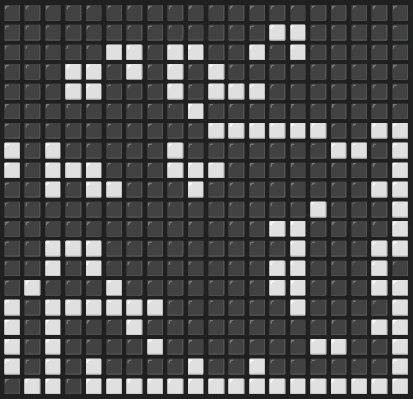

# Conway's Game of Life in Python

Very simple implementation of [Conway's Game of Life Algorithm](https://en.wikipedia.org/wiki/Conway%27s_Game_of_Life).

The initial state of the grid is generated at random



### Create and activate virtual environment
```
python3 -m venv .venv && source .venv/bin/activate
```
### Install dependencies
```
pip install -r requirements.txt
```

### Run simulation

```
python src/cli.py simulate --tick-interval 1 --grid-size 20
```

Try diferent grid sizes and tick intervals. Enjoy.